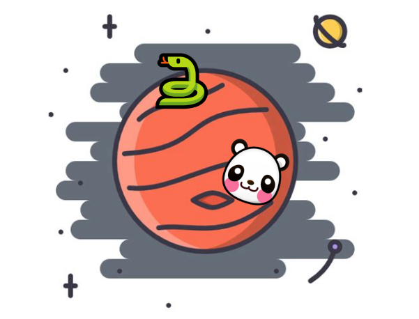

# Data analysis with Python @ EIJC2020

## About this repo
This Github repository was created for the Data Analysis with Python sessions[1](https://dataharvesteijc2020.sched.com/event/dkjb/data-analysis-with-pandas-on-jupyter-1?iframe=no),[2](https://dataharvesteijc2020.sched.com/event/dkje/data-analysis-with-pandas-on-jupyter-2?iframe=no),[3](https://dataharvesteijc2020.sched.com/event/dkjh/data-analysis-with-pandas-on-jupyter-3?iframe=no) during the [DataHarvest+](https://dataharvest.eu) European Investigative Journalism Conference. During three session of about an hour, we took participants through the process of retrieving, cleaning, analysing, transforming, combining and visualising a dataset in the Jupyter environment. These were a showcase sessions, but you could follow along in your own time, by downloading [Anaconda](https://www.anaconda.com/products/individual#Downloads) and our notebooks which are all stored in this repo. 

## Used in the training
- obviously Python3
- libraries needed: `pandas`, `altair`, `requests`, `beautifulsoup4`
- data [from Eurostat](https://appsso.eurostat.ec.europa.eu/nui/show.do?query=BOOKMARK_DS-1180622_QID_-B1BCB1E_UID_-3F171EB0&layout=PERIOD,L,X,0;REPORTER,L,Y,0;PARTNER,C,Z,0;PRODUCT,L,Z,1;FLOW,L,Z,2;INDICATORS,C,Z,3;&zSelection=DS-1180622PARTNER,EU27_2020_EXTRA;DS-1180622FLOW,1;DS-1180622PRODUCT,A;DS-1180622INDICATORS,VALUE_IN_EUROS;&rankName1=PARTNER_1_2_-1_2&rankName2=INDICATORS_1_2_-1_2&rankName3=FLOW_1_2_-1_2&rankName4=PRODUCT_1_2_-1_2&rankName5=PERIOD_1_0_0_0&rankName6=REPORTER_1_2_0_1&sortC=ASC_-1_FIRST&rStp=&cStp=&rDCh=&cDCh=&rDM=true&cDM=true&footnes=false&empty=false&wai=false&time_mode=NONE&time_most_recent=false&lang=EN&cfo=%23%23%23,%23%23%23.%23%23%23)

## Words of encouragement
  To be the noun, you have to do the verb. Wanne be a painter? Paint. Wanna be a programming data journalist? Program to make data journalistic stories... Note how there are no conditions like quality or duration. If you want to become a data-driven journalist who uses Python programming to analyse data and find stories, *all* you have to do is start. 
  While that is true, be kind to yourself and start small. Start small! (Remember that a good story doesn't necessarily need a big dataset, it needs a big insight.) Also, the problem of good taste is very real, and you either overcome it or fail. Ira said it first...
 
 **Ira Glass on the problem of good taste**  
 *Why?* The problem of good taste is a problem every beginner in every field has to overcome.
 https://www.youtube.com/watch?v=X2wLP0izeJ

## Resources 
 **Book Python for Everybody**
 *Why?* Friendly and free introduction to Python (also comes with a Coursera course with the same name)
 https://www.py4e.com/book
 
 **Basic introduction to Python**
 *Why?* Getting basics like the syntax right before diving in the deep end is a smart thing to do
 https://www.datacamp.com/courses/intro-to-python-for-data-science
 
 **Online Python course aimed at journalists**
 *Why?* especially aimed at journalists, and Winny made it. ;) 
 https://datajournalism.com/watch/python-for-journalists
 
 **Article on Altair and its upsides**
 http://fernandoi.cl/blog/posts/altair/
 
 **Annotated Python code**
 *Why?* Learning to code starts by understanding code written by someone else, and editing it for your own purposes. Just like learning any other language. This repo contains commented Jupyter Notebooks to help you ease into Python programming for journalism.
 https://github.com/winnydejong/next/
 
 **The second Data Journalism Handbook**
 *Why?* While [the first handbook](https://datajournalism.com/read/handbook/one) zooms in on why data journalism is important; the second promises to be even more interesting explaining how to actually go about data journalism. Partly published already, expected to be online in full this fall. 
 https://datajournalism.com/read/handbook/two
 
 **About Altair vs Matplotlib** 
- mathplotlib is a classic; you should probably learn a little bit of this too;
- mathplotlib needs less code to create a chart;
- altair has a clearer syntax;
- altair is better at interactivity;
- altair charts can be adjusted in many many ways (also: more code ;) )
 There are other libraries you can use to make charts: ggpy, bokeh, seaborn, plotly. All of them have slightly different advances. When you're beginning, simply pick one and learn it. :) 

